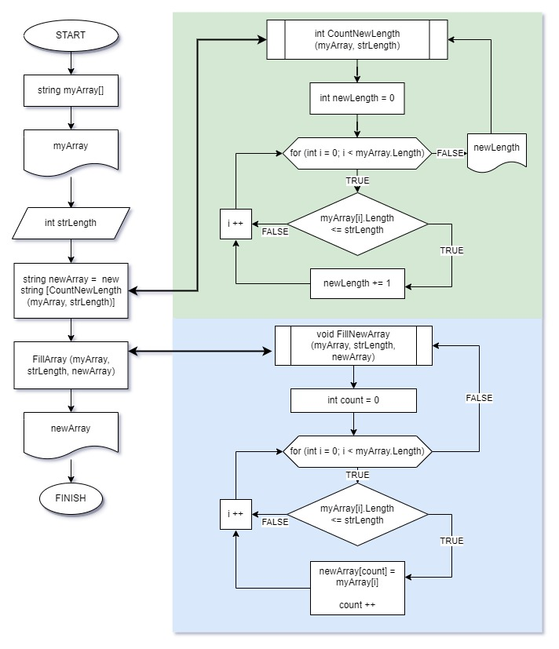

# Итоговый проект по базовому блоку
1. Создать репозиторий на GitHub.
2. Нарисовать блок-схему алгоритма (можно обойтись блок-схемой основной содержательной части, если вы выделяете её в отдельный метод).
3. Снабдить репозиторий оформленным текстовым описанием решения (файл README.md).
4. Написать программу, решающую поставленную задачу.
5. Использовать контроль версий в работе над этим небольшим проектом (не должно быть так, что всё залито одним коммитом, как минимум этапы 2, 3, и 4 должны быть расположены в разных коммитах).

## **ЗАДАЧА**: 
>Написать программу, которая из имеющегося массива строк формирует новый массив из строк, длина которых меньше, либо равна 3 символам. Первоначальный массив можно ввести с клавиатуры, либо задать на старте выполнения алгоритма. При решении не рекомендуется пользоваться коллекциями, лучше обойтись исключительно массивами.

## **ПРИМЕРЫ:**
``[“Hello”, “2”, “world”, “:-)”] → [“2”, “:-)”]``

``[“1234”, “1567”, “-2”, “computer science”] → [“-2”]``

``[“Russia”, “Denmark”, “Kazan”] → []``

## **РЕШЕНИЕ**
1. Cоздаем без пользователя массив из нескольких строковых переменных разной длины.
2. Запрашиваем у пользователя: меньше (или равно) какой длины элементы мы хотим поместить в новый массив.
3. Считаем, сколько элементов, удовлетворяющих условию, имеются в заданном массиве, чтобы вычислить размерность нового массива.
4. Создаем новый массив.
5. Переписываем в него все подходящие запросу элементы.

## **БЛОК-СХЕМА**
